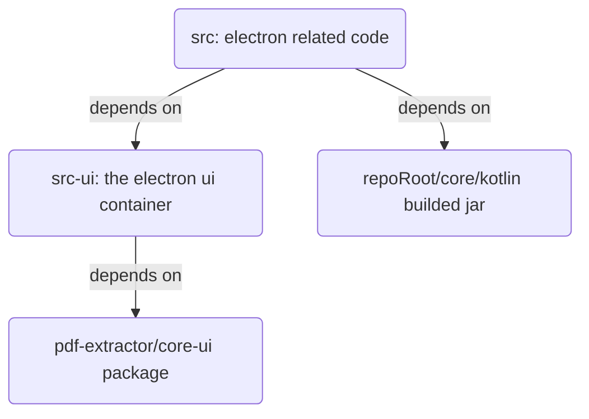
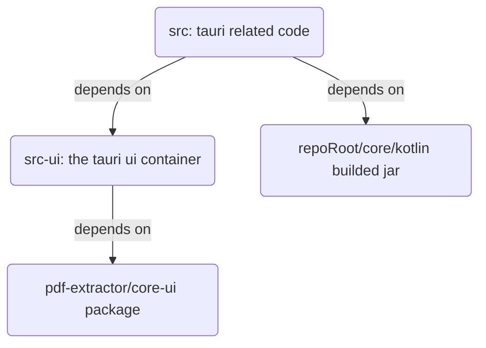

# Electron client

## 1. setup

Follow the below steps to start dev work or bundle the app.

- if you are not install dependencies in root folder, then install the dependencies here by using `pnpm install`.

- For dev mode, run `pnpm dev`, it will load the electron dev mode app.

- For prod package/distribution, run `pnpm make` to generate distributions. It will generate distribution files in **out** folder.

Note:

- If you see link dynamic lib error in dev mode, it's probably because the electron does not install correctly or it's getting crashed and the crash status get cached. Use `pnpm store prune` to clear pnpm cache. Then in the project client root folder, run `pnpm install` again.

## 2. build process

The project dependency is as follows:

So when build, we should build from down to top. The `pnpm dev` and `pnpm make` already take cares of the build process, so you can just use these 2 commands to start dev env or build the final product.

# Tauri client

## 1. setup

Follow the below steps to start dev work or bundle the app.

- if you are not install dependencies in root folder, then install the dependencies here by using `pnpm install`.
- For dev mode, run `pnpm dev`, it will load the tauri dev mode app.

- For prod package/distribution, run `pnpm make` to generate the bundle. The builded file will be located at `src/target/release/bundle/`.

## 2. build process

The project dependency is as follows:

So when build, we should build from down to top. The `pnpm dev` and `pnpm make` already take cares of the build process, so you can just use these 2 commands to start dev env or build the final product.
